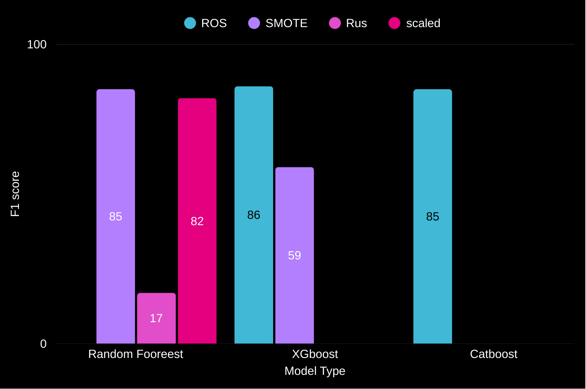
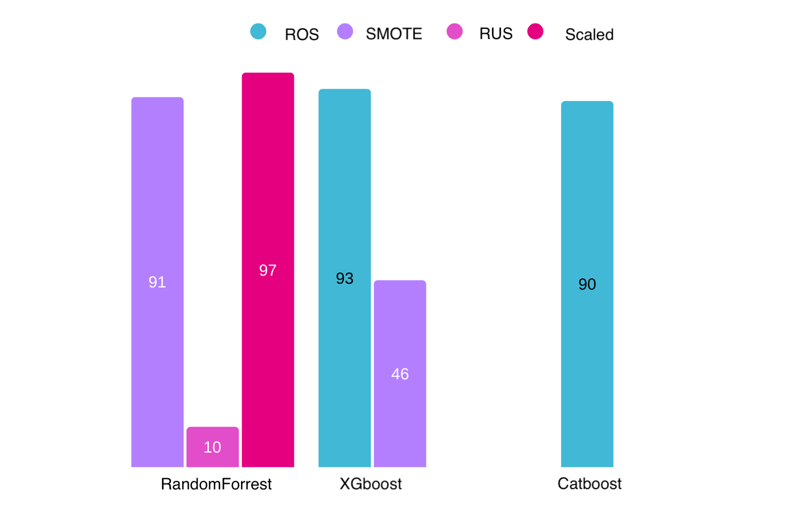
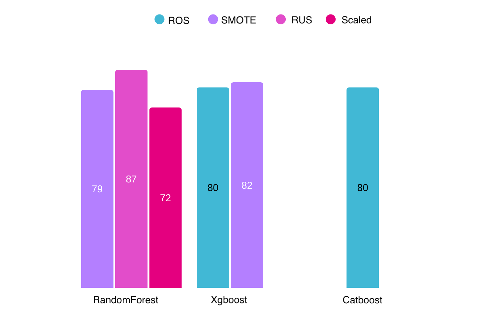

# 📌 Overview :
This project is a machine learning fraud detection model built and trained using python , deployed on Gradio and streamlit

Fraud drains billions of dollars each year , it’s methods just keep getting better and better. What if we can detect and stop these fraudulent transactions from even happening . Prevention is not just cheaper than recovery — it’s smarter.
---
## Features:
1. Multiple models trained to get highest recall,precision , and f1-score.

2. Deployed on Streamlit and gradio.

3. A docker file is included to be built.
---

## Project Structure:

<pre> fraud-detector/ │── FinalVersion.py # Gradio app │── streamlit.py # Streamlit app │── requirements.txt # Python dependencies │── fraud_model.pkl # Trained ML XGBoost model │── scaler.pkl # Data scaler │── fraud_model_Cat # Trained ML CatBoost model │── fraud_model_RF # Trained ML Random Forest model │── preprocessing.ipynb # Training and preprocessing notebook │── creditcard_small.csv # Small dataset sample │── firstEditon.py # Gradio app demo │── README.md # Project documentation │── images/ # Images used </pre>
---

## Installation & Usage:

1. Clone it:

<pre> git clone https://github.com/MohammadDaadour/Credit-Card-Fraud_Detection
cd fraud-detector  </pre>

2. Streamlit app:

[Streamlit](https://credit-card-frauddetectionmycopy-uxsrpasyytyvntoqpslndw.streamlit.app/)

3. Gardio app:

[Streamlit](https://huggingface.co/spaces/Abdo-sudo/Fraud_Detection_project)

4. Docker :
To use docker access this repo :
[repo](https://github.com/Abdo-su-do/Fraud_project_Docker)

then pull it and run in your terminal:

<pre> docker build -t fraud-detector . </pre>
---

## Models Used and their performance:

---

## License
This project is licensed under the MIT License.

